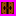

# Bomberman Game 

   

## Description of objects in Bomberman game

If you have ever played Bomberman, you will be familiar with these objects. They are divided into two main groups: the dynamic objects (_Bomber_, _Enemy_, _Bomb_) and the static objects (_Grass_, _Wall_, _Brick_, _Door_, _Item_).

-  _Bomber_ s the main character of the game. Bomber can move in four directions left/right/up/down controlled by the player.
-  _Enemy_ is the object that Bomber has to eliminate to pass the level. Enemies can move randomly or chase after Bomber depending on the type of enemy. The types of enemy will be described specifically below.
-  _Bomb_ is the object that Bomber will place and activate on Grass cells. Once activated, Bomber and Enemy cannot move to the Bomb's position. However, as soon as Bomber places and activates the Bomb at their location, Bomber can move once from the Bomb's position to the adjacent position. After being activated for 2 seconds, the Bomb will automatically explode, creating _Flame_  objects.

-  _Grass_ is the object that Bomber and Enemy can move through and allows Bomber to place a Bomb on its position.
-  _Wall_ is a fixed object that cannot be destroyed by a Bomb and cannot have a Bomb placed on it. Bomber and Enemy cannot move into this object.
-  _Brick_ is an object placed on Grass cells that cannot have a Bomb placed on it but can be destroyed by a Bomb placed nearby. Bomber and Enemy cannot move into the position of a Brick that has not yet been destroyed.

-  _Portal_ is an object hidden behind a Brick object. When that Brick is destroyed, the Portal will appear, and if all Enemies have been eliminated, the player can go to another Level by moving to the Portal's position.

_Items_ are also hidden behind Bricks and only appear when the Brick is destroyed. Bomber can use the Item by moving to its position. Information about the function of each Item is listed below:

-  _SpeedItem_ : When using this Item, Bomber's movement speed will be increased by an appropriate value.
-  _FlameItem_ Item : This Item helps to increase the range of influence of a Bomb when it explodes (the length of the Flame is increased).
-  _BombItem_ : Normally, if there is no Bomb object in the activated state, Bomber will be able to place and activate only one Bomb object. This Item helps to increase the number of Bomb objects that can be placed by one.

There are many types of enemies in Bomberman, however, in this version, I have installed the following types of enemies:

-  _Balloom_ is the simplest Enemy, moving randomly at a fixed speed.
-  _Oneal_ has a changing movement speed, sometimes fast, sometimes slow, and moves "smarter" than Balloom (knows how to chase after Bomber).
-  _Doll_: Its movement speed is slow, when it faces Bomber (horizontally or vertically) and there is no obstacle in between (including Bomb), it will increase its movement speed and chase after Bomber.

## Gameplay, collision handling, and bomb explosion processing are described as follows:
- In a level, the player controls the Bomber character, placing and activating bombs with the main goal of destroying all enemies and finding the Portal to advance to the next level.

- The Bomber will be killed if it collides with an enemy or is within the blast radius of a bomb. The game ends at that point.

- Enemies are destroyed when they are within the blast radius of a bomb.

- An object is within the blast radius of a bomb if it collides with one of the flames created at the time the bomb explodes.

- When a bomb explodes, a Flame  is created at the center of the explosion and four Flames are created at the four adjacent tiles in the four cardinal directions up , down , left , right .The default length of each Flame is one tile, which can be increased when the Bomber uses Flame Items.

- When Flames appear, if a Brick/Wall object is present on a tile that is part of a Flame, the length of that Flame will be reduced so that the Flame only extends up to the position of the Brick/Wall object in the direction it is moving. Only the Brick/Wall object is affected by the Flame at that point, while subsequent objects are not affected. However, if the obstacle in the Flame's path is another bomb object, that bomb will also explode immediately.

## GAME INTERFACE AND LEVELS

 

### I designed 3 levels: level 1, level 2, and level 3. The difficulty level increases progressively with each level.

## Inheritance tree for Game objects.

 [Inheritance tree for Game objects](https://github.com/VuTuanAnh-1368/Bomberman/blob/main/UML%20Bomberman.pdf)
 
## Setting
* Write in Java programming language.
* Using IntelliJ IDEA.
* Add `VM options`:
  * `Run` -> `Edit Configurations...`
    -> `Modify options` -> `Add VM options`:
    > --module-path /path/to/javafx-sdk-20.0.1\lib
    > --add-modules
    > javafx.controls
    > --add-modules
    > javafx.fxml
* `Run` -> `Run BombermanGame`
